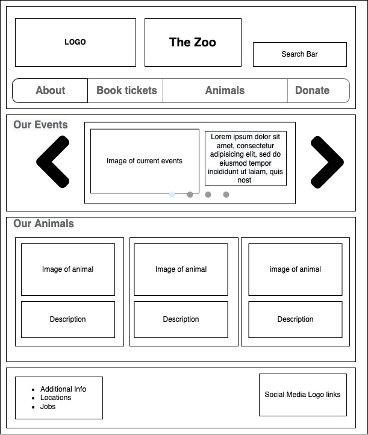

# Zoo Website Wire Frame

 I am designing a website for a zoo
 
 - The header will include the A logo, the name and a nav bar of the categories on the site.
 
 - THe first section will showcase the events going on which can be cycled through. 

- The next section will have a multiple cards showing the animals at the zoo.
- Footer holds additional info and social media links
 

